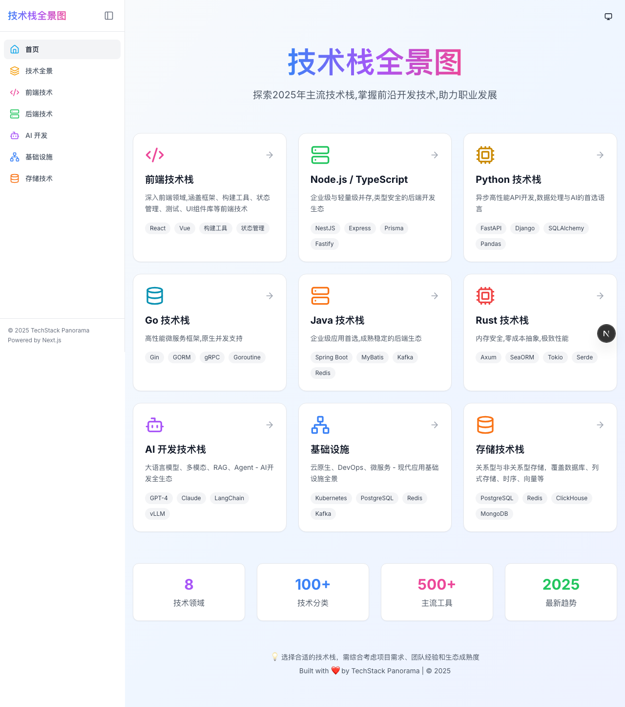
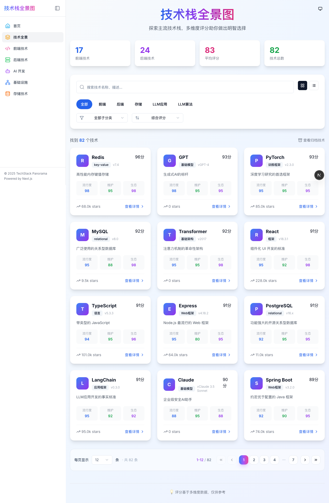
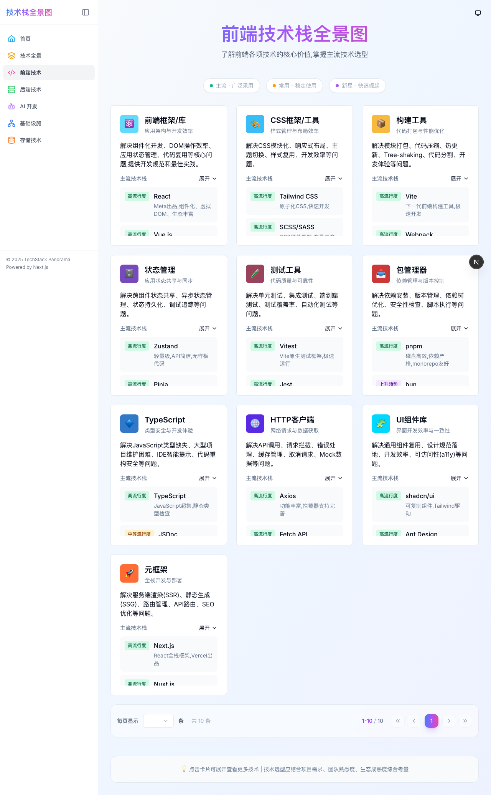
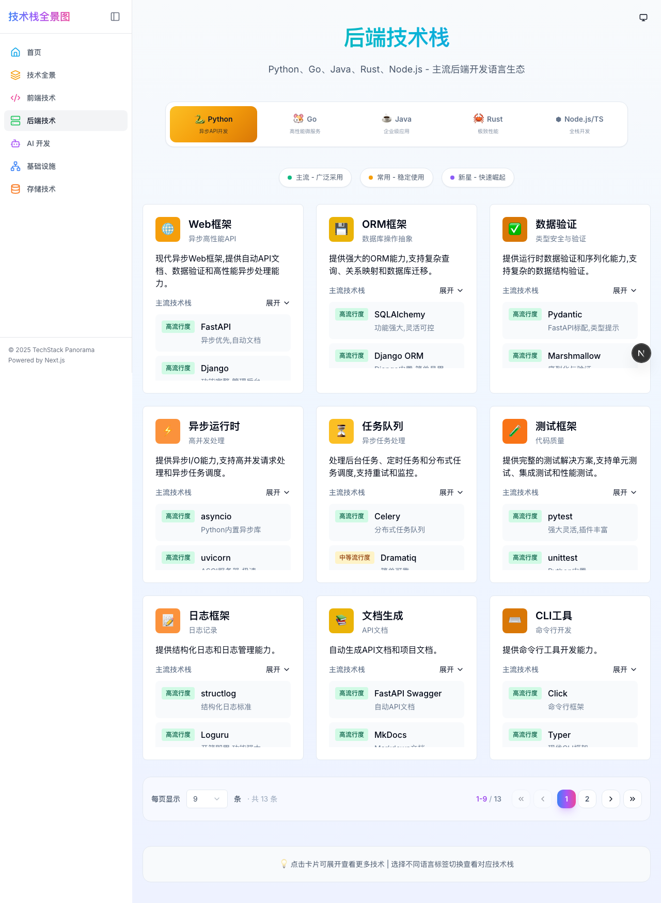
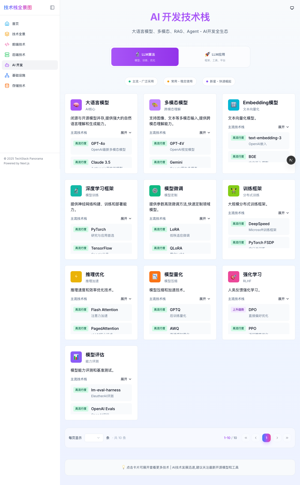
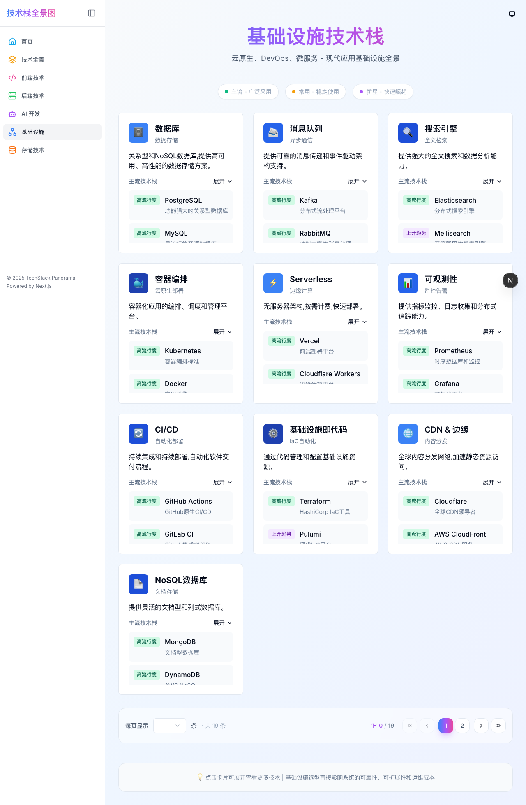

# 🚀 TechStack Panorama (技术栈全景图)

[](https://github.com/platootalp/techstack-panorama)
[](https://nextjs.org/)
[](https://www.typescriptlang.org/)
[](https://tailwindcss.com/)
[](LICENSE)

> 一个现代化的全栈技术栈可视化平台，涵盖前端、后端(Node.js/Python/Go/Java/Rust)、AI开发、基础设施等完整技术生态。

## 📖 目录

- [项目简介](#-项目简介)
- [功能特性](#-功能特性)
- [技术架构](#-技术架构)
- [项目结构](#-项目结构)
- [快速开始](#-快速开始)
- [开发指南](#-开发指南)
- [部署说明](#-部署说明)
- [贡献指南](#-贡献指南)
- [许可证](#-许可证)

## 🎯 项目简介

TechStack Panorama 是一个开源的技术栈全景图展示平台，旨在帮助开发者快速了解和学习现代软件开发中使用的各种技术、框架和工具。项目通过可视化的方式展示技术分类，每个分类包含主流、常用和新兴的技术选项。

### 核心页面

| 页面 | 路径 | 描述 |
|------|------|------|
| 🏠 **首页** | `/` | 项目入口，展示统计数据和导航卡片 |
| 📚 **技术全景** | `/tech-stack` | 统一技术栈浏览页面，支持分类查看 |
| 💻 **前端技术栈** | `/frontend` | 前端领域技术分类（框架、构建工具、状态管理等） |
| 🔧 **后端技术栈** | `/backend` | 统一后端页面，支持多语言切换（Python/Go/Java/Rust/Node.js） |
| 🤖 **AI开发栈** | `/ai-stack` | AI开发相关技术（LLM、训练框架、部署工具等） |
| 🏗️ **基础设施** | `/infrastructure` | DevOps、数据库、缓存、消息队列等 |
| 📊 **全部技术** | `/tech-stack-all` | 所有技术的综合视图 |

### 📸 界面预览

| 首页 | 技术全景 |
|:---:|:---:|
|  |  |

| 前端技术栈 | 后端技术栈 |
|:---:|:---:|
|  |  |

| AI开发栈 | 基础设施 |
|:---:|:---:|
|  |  |

## ✨ 功能特性

### 🎨 视觉设计
- **渐变色主题**：蓝紫粉渐变配色方案
- **深色/浅色模式**：支持 `light`/`dark`/`system` 三种主题模式
- **响应式布局**：完美适配桌面、平板、移动设备
- **流畅动画**：使用 Framer Motion 实现优雅的过渡效果

### 🧭 导航系统
- **可折叠侧边栏**：左侧固定导航，支持展开/收起
- **高亮当前页面**：直观的视觉反馈
- **图标+文字**：双重提示，提升可用性
- **移动端适配**：小屏幕下自动收起

### 📊 技术展示
- **分类浏览**：100+ 技术分类，500+ 技术工具
- **标签系统**：主流(Mainstream) / 常用(Common) / 新星(Rising)
- **详细信息**：每个技术包含描述、官网链接
- **多语言支持**：后端技术栈按语言分类展示

### 🌓 主题切换
- 顶部导航栏集成主题切换按钮
- 支持跟随系统主题
- 平滑的主题过渡动画

## 🏗️ 技术架构

### 核心栈

```
┌─────────────────────────────────────────────────────────────┐
│                      TechStack Panorama                      │
├─────────────────────────────────────────────────────────────┤
│  Frontend Layer                                              │
│  ├── Next.js 16 (App Router)                                 │
│  ├── React 19                                                │
│  ├── TypeScript 5                                            │
│  └── Tailwind CSS 3.4                                        │
├─────────────────────────────────────────────────────────────┤
│  UI Components                                               │
│  ├── shadcn/ui (49+ 组件)                                    │
│  ├── Radix UI Primitives                                     │
│  ├── Lucide React (图标)                                     │
│  └── Framer Motion (动画)                                    │
├─────────────────────────────────────────────────────────────┤
│  State Management                                            │
│  ├── Zustand (全局状态)                                      │
│  ├── TanStack Query (数据同步)                               │
│  └── React Hook Form (表单)                                  │
└─────────────────────────────────────────────────────────────┘
```

## 📁 项目结构

```
techstack-panorama/
├── 📁 docs/                       # 文档目录
├── 📁 prisma/                     # 数据库 schema
├── 📁 public/                     # 静态资源
├── 📁 src/
│   ├── 📁 app/                    # Next.js App Router
│   │   ├── 📁 ai-stack/           # AI 开发栈页面
│   │   ├── 📁 backend/            # 后端技术栈
│   │   │   ├── page.tsx           # 统一后端入口
│   │   │   ├── 📁 python/         # Python 生态
│   │   │   ├── 📁 go/             # Go 生态
│   │   │   ├── 📁 java/           # Java 生态
│   │   │   ├── 📁 rust/           # Rust 生态
│   │   │   └── 📁 nodejs/         # Node.js 生态
│   │   ├── 📁 frontend/           # 前端技术栈页面
│   │   ├── 📁 infrastructure/     # 基础设施页面
│   │   ├── 📁 tech-stack/         # 技术全景浏览页面
│   │   │   ├── page.tsx           # 技术列表页
│   │   │   └── 📁 [id]/           # 技术详情页
│   │   ├── 📁 tech-stack-all/     # 全部技术综合视图
│   │   ├── layout.tsx             # 根布局（含侧边栏、主题）
│   │   ├── page.tsx               # 首页
│   │   └── globals.css            # 全局样式（含主题变量）
│   ├── 📁 components/             # 组件目录
│   │   ├── 📁 ui/                 # shadcn/ui 组件 (49+)
│   │   ├── sidebar.tsx            # 侧边栏导航
│   │   ├── header.tsx             # 顶部导航栏
│   │   ├── theme-provider.tsx     # 主题提供者
│   │   ├── theme-toggle.tsx       # 主题切换按钮
│   │   └── error-boundary.tsx     # 错误边界
│   ├── 📁 data/                   # 数据文件
│   │   └── 📁 tech/               # 技术栈数据
│   ├── 📁 hooks/                  # 自定义 Hooks
│   ├── 📁 lib/                    # 工具函数
│   └── 📁 test/                   # 测试配置和工具
├── 📄 .gitignore                  # Git 忽略配置
├── 📄 bun.lock                    # Bun 锁文件
├── 📄 components.json             # shadcn/ui 配置
├── 📄 next.config.ts              # Next.js 配置
├── 📄 package.json                # 项目依赖
├── 📄 README.md                   # 项目文档
├── 📄 tailwind.config.ts          # Tailwind 配置
├── 📄 tsconfig.json               # TypeScript 配置
└── 📄 vitest.config.ts            # Vitest 测试配置
```

## 🛠️ 技术栈

### 核心依赖
| 包名 | 版本 | 用途 |
|------|------|------|
| `next` | ^16.1.1 | React 全栈框架 |
| `react` | ^19.0.0 | UI 库 |
| `typescript` | ^5 | 类型系统 |
| `tailwindcss` | ^3.4.17 | 原子化 CSS |

### UI 组件
| 包名 | 用途 |
|------|------|
| `@radix-ui/*` | 无障碍 UI 基础组件 |
| `lucide-react` | 图标库 |
| `framer-motion` | 动画库 |
| `class-variance-authority` | 组件变体管理 |
| `recharts` | 图表库 |

### 数据与状态
| 包名 | 用途 |
|------|------|
| `zustand` | 状态管理 |
| `@tanstack/react-query` | 数据同步 |
| `@tanstack/react-table` | 表格组件 |
| `@prisma/client` | ORM |
| `zod` | 数据校验 |

### 表单与编辑
| 包名 | 用途 |
|------|------|
| `react-hook-form` | 表单管理 |
| `@hookform/resolvers` | 表单校验集成 |
| `@mdxeditor/editor` | MDX 编辑器 |
| `react-markdown` | Markdown 渲染 |
| `react-syntax-highlighter` | 代码高亮 |

### 其他功能
| 包名 | 用途 |
|------|------|
| `@dnd-kit/*` | 拖拽功能 |
| `next-auth` | 身份认证 |
| `next-intl` | 国际化 |
| `next-themes` | 主题管理 |

### 测试
| 包名 | 用途 |
|------|------|
| `vitest` | 测试框架 |
| `@testing-library/react` | React 测试工具 |
| `@testing-library/jest-dom` | DOM 断言 |
| `@vitest/coverage-v8` | 测试覆盖率 |

## 🚀 快速开始

### 环境要求

- **Node.js**: 18.17.0 或更高版本
- **Bun**: 1.0.0 或更高版本（推荐）
- **Git**: 2.30.0 或更高版本

### 安装步骤

#### 1. 克隆仓库

```bash
git clone https://github.com/platootalp/techstack-panorama.git
cd techstack-panorama
```

#### 2. 安装依赖

```bash
# 使用 Bun（推荐）
bun install

# 或使用 npm
npm install
```

#### 3. 启动开发服务器

```bash
bun run dev
```

访问 http://localhost:3888 查看应用。

#### 4. 构建生产版本

```bash
bun run build
bun start
```

## 📊 技术栈详情

### 前端技术栈涵盖

| 分类 | 技术数量 | 包含内容 |
|------|---------|---------|
| **框架与库** | 15+ | React, Vue, Angular, Svelte, Solid 等 |
| **元框架** | 10+ | Next.js, Nuxt, Astro, Remix 等 |
| **构建工具** | 12+ | Vite, Webpack, esbuild, Rollup 等 |
| **状态管理** | 8+ | Redux, Zustand, Jotai, Pinia 等 |
| **样式方案** | 10+ | Tailwind, Styled Components, CSS Modules 等 |
| **UI 组件库** | 12+ | shadcn/ui, MUI, Ant Design, Chakra UI 等 |

### 后端技术栈涵盖

#### Python 生态
- **Web框架**: Django, FastAPI, Flask, Tornado
- **ORM**: SQLAlchemy, Django ORM, Tortoise ORM
- **工具**: Celery, Pydantic, Typer

#### Go 生态
- **Web框架**: Gin, Echo, Fiber, Beego
- **ORM**: GORM, Ent, Bun
- **工具**: Cobra, Viper

#### Java 生态
- **Web框架**: Spring Boot, Quarkus, Micronaut
- **ORM**: Hibernate, MyBatis, JPA
- **工具**: Lombok, MapStruct

#### Rust 生态
- **Web框架**: Axum, Actix-web, Rocket, warp
- **ORM**: Diesel, SeaORM, sqlx
- **工具**: Clap, Serde

#### Node.js 生态
- **Web框架**: Express, Fastify, NestJS, Koa
- **ORM**: Prisma, TypeORM, Sequelize
- **工具**: Commander, Inquirer

### AI 开发栈涵盖

| 领域 | 技术示例 |
|------|---------|
| **核心模型** | GPT-4, Claude, Llama, Gemini |
| **应用框架** | LangChain, LlamaIndex, Haystack |
| **训练框架** | PyTorch, TensorFlow, JAX |
| **部署工具** | vLLM, TensorRT, ONNX Runtime |
| **向量数据库** | Pinecone, Weaviate, Milvus |

### 基础设施涵盖

- **容器**: Docker, Kubernetes, Podman
- **CI/CD**: GitHub Actions, GitLab CI, Jenkins
- **云平台**: AWS, Azure, GCP, Vercel
- **数据库**: PostgreSQL, MySQL, MongoDB, Redis
- **消息队列**: Kafka, RabbitMQ, NATS
- **监控**: Prometheus, Grafana, Datadog

## 💻 开发指南

### 可用脚本

```bash
# 开发模式（端口 3888）
bun run dev

# 构建生产版本
bun run build

# 启动生产服务器
bun start

# 代码检查
bun run lint

# 运行测试
bun run test           # 监听模式运行测试
bun run test:run       # 单次运行测试
bun run test:coverage  # 运行测试并生成覆盖率报告

# 数据库操作（需要配置数据库）
bun run db:push      # 推送数据库结构
bun run db:generate  # 生成 Prisma Client
bun run db:migrate   # 运行迁移
bun run db:reset     # 重置数据库
```

### 代码规范

- **TypeScript**: 所有代码使用 TypeScript，确保类型安全
- **ESLint**: 遵循项目 ESLint 配置
- **组件命名**: 使用 PascalCase（如 `Sidebar.tsx`）
- **文件组织**: 按功能模块组织，相关文件放一起
- **样式**: 使用 Tailwind CSS，遵循 utility-first 原则

### 添加新页面

1. 在 `src/app/` 下创建新目录
2. 添加 `page.tsx` 文件
3. 在 `src/components/sidebar.tsx` 中添加导航项

## 📦 部署说明

### 构建生产版本

```bash
bun run build
```

构建输出位于 `.next/standalone/` 目录（独立模式）。

### 部署到 Vercel

```bash
# 安装 Vercel CLI
npm i -g vercel

# 部署
vercel --prod
```

### 部署到自有服务器

```bash
bun run build
bun start
```

服务器将在端口 3888 启动（开发模式）。

## 🤝 贡献指南

我们欢迎所有形式的贡献！

### 如何贡献

1. **Fork** 本仓库
2. 创建你的 **Feature Branch** (`git checkout -b feature/AmazingFeature`)
3. **Commit** 你的更改 (`git commit -m 'Add some AmazingFeature'`)
4. **Push** 到 Branch (`git push origin feature/AmazingFeature`)
5. 创建一个 **Pull Request**

### 贡献内容

- 添加新的技术分类或工具
- 修复错误或过时的信息
- 改进 UI/UX 设计
- 添加新功能
- 改进文档

### 报告问题

如果你发现了 bug 或有功能建议，请通过 [GitHub Issues](https://github.com/platootalp/techstack-panorama/issues) 提交。

## 📝 许可证

本项目基于 [MIT](LICENSE) 许可证开源。

## 🙏 致谢

- [shadcn/ui](https://ui.shadcn.com/) - 优秀的 UI 组件库
- [Next.js](https://nextjs.org/) - React 全栈框架
- [Tailwind CSS](https://tailwindcss.com/) - 实用优先的 CSS 框架
- [Lucide](https://lucide.dev/) - 精美的图标库

---

<div align="center">

Built with ❤️ by [TechStack Panorama Team](https://github.com/platootalp)

© 2025 TechStack Panorama. All rights reserved.

</div>
